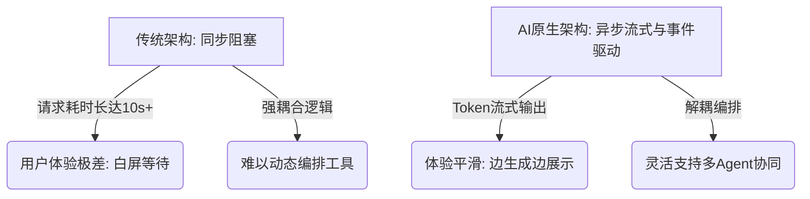

# 问题与挑战

当开发者从“使用AI辅助编程”跨越到“构建AI驱动应用”时，往往会遭遇传统软件工程方法论与概率性模型之间的剧烈摩擦。大语言模型（LLM）并非传统意义上输入确定、输出确定的函数，这种本质差异导致开发者在实际落地时面临四大核心痛点。

### 1. 生成内容的幻觉与质量失控

传统软件的Bug通常源于逻辑边界条件处理不当，而AI应用的Bug往往表现为“一本正经地胡说八道”。LLM的本质是基于概率的下一个Token预测模型，当它缺乏足够的信息或被诱导时，会生成看似合理但实则虚构的内容（即幻觉）。

在代码生成与执行场景中，这种失控尤为致命。例如，当我们让AI动态生成并执行查询代码时，它可能虚构出不存在的API或表字段。以下是开发者在构建Text-to-SQL应用时常遇到的典型陷阱：

```python
# 开发者期望的查询
expected_query = "SELECT user_name, email FROM users WHERE status = 'active';"

# LLM 实际生成的幻觉代码（使用了不存在的列名和表）
hallucinated_query = "SELECT username, user_email FROM active_users WHERE is_active = 1;"
```

由于缺乏编译期的强类型检查，这种幻觉代码在运行前看似合法，一旦执行便会导致应用崩溃或数据泄漏。开发者无法再依赖传统的单元测试覆盖所有分支，因为输入空间是无限的自然语言集合。

### 2. 上下文窗口的物理限制与信息丢失

尽管当前主流大模型的上下文窗口已从数K扩展至128K甚至200K，但在真实的企业级应用中，这依然远远不够。构建一个企业级知识库问答系统时，我们需要在Prompt中塞入系统角色设定、Few-shot示例、RAG检索到的数十篇长文档以及用户的多轮对话历史。

当输入信息量逼近或超过上下文限制时，模型不仅会截断超出的部分，还会出现**“中间迷失”**现象——对位于Prompt中间位置的关键信息产生遗忘。这种限制迫使开发者不得不在应用层进行复杂的上下文压缩、分块与路由策略设计，极大地增加了架构的复杂度。

### 3. 应用输出的非确定性与状态管理难题

传统软件架构基于“确定状态机”构建，相同的输入永远产生相同的输出。而LLM是**非确定性系统**，即使设置 `temperature=0`，在某些底层实现中依然无法保证绝对的输出一致性。

这种非确定性给系统带来了两个严峻挑战：
* **自动化测试的失效**：传统的断言（如 `assertEquals`）在AI输出面前毫无意义，开发者不得不转向使用模糊匹配或引入另一个LLM作为裁判来评估输出质量，测试成本高昂。
* **状态流转的失控**：在多步Agent任务中，如果某一步的输出格式发生微小偏移，可能导致后续依赖该输出的工具调用失败，引发连锁反应。

### 4. 传统架构难以支撑智能场景的扩展

传统MVC（Model-View-Controller）架构与RESTful API设计初衷是为了处理无状态的、结构化的CRUD操作。然而，AI原生应用具有**长任务、流式输出、有状态、多智能体协同**的特征。

当应用需要协调多个LLM进行意图识别、内容生成和结果校验时，传统的同步阻塞式请求-响应模型会导致极差的用户体验（如长达数十秒的白屏等待）。此外，传统架构缺乏对“长文本流式传输”和“工具动态编排”的原生支持，导致开发者在实现复杂Agent工作流时，往往写出难以维护的“面条代码”。



面对上述挑战，开发者必须完成从“调包侠”到“AI架构师”的认知升级。我们需要引入新的工程范式来驯服非确定性，用架构的确定性去包裹大模型的概率性。接下来的章节将深入探讨如何通过提示词工程与RAG技术，从源头解决幻觉与上下文限制问题。
