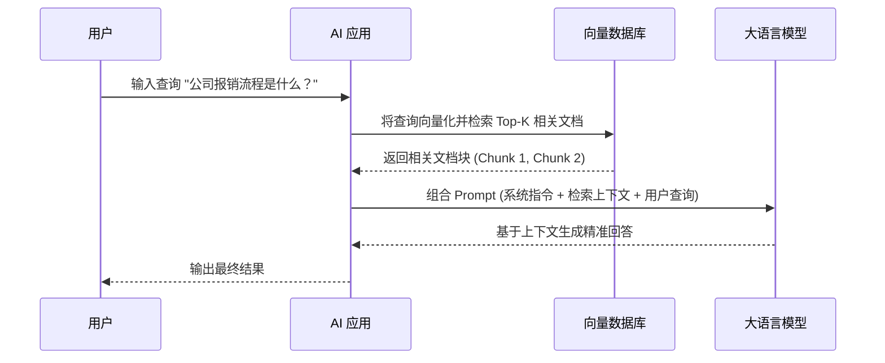

# 核心概念

在跨越了传统软件确定性逻辑与概率性模型之间的摩擦后，开发者需要重新建立对底层技术栈的认知。大语言模型（LLM）在应用架构中的角色正在从“高级文本生成器”向“动态逻辑调度枢纽”演进。本章将厘清AI辅助开发与AI原生开发的边界，并深入拆解构建AI驱动应用不可或缺的四大核心概念：提示词工程、检索增强生成（RAG）、函数调用与智能体。

### 1. AI辅助开发 vs AI原生开发

理解概念的第一步是明确架构边界。这两者并非对立，而是处于软件演进的不同维度。

*   **AI辅助开发**：AI作为开发者的生产力工具存在。开发者使用 GitHub Copilot 生成样板代码，或通过 ChatGPT 查询正则表达式。在此模式下，AI 介入的是**研发过程**，最终交付的软件本身并不依赖大模型运行，其核心架构依然是传统的 CRUD 与确定性状态机。
*   **AI原生开发**：AI 作为应用架构的核心驱动力存在。在 AI 原生架构中，大模型不仅是功能模块，更是系统的“中央处理器”或“逻辑路由”。应用的业务流程不再由硬编码的 `if-else` 主导，而是由 LLM 根据自然语言输入、上下文记忆和外部工具动态决策。

> **架构启示**：从 AI 辅助走向 AI 原生，本质上是将系统的控制权部分让渡给概率性模型。开发者不再编写所有业务路径，而是设计“护栏”与“工具箱”，引导 LLM 在既定边界内自主完成复杂任务。

### 2. 提示词工程

提示词工程绝非简单的“如何与AI对话”，它是**面向概率性模型的接口编程**。在传统 API 调用中，参数类型严格匹配；而在提示词工程中，开发者通过自然语言构建上下文，约束模型的输出空间。

其底层运作原理依赖于 LLM 的自回归特性：模型基于给定的前文（Prompt），预测下一个 Token 的概率分布。因此，高质量的提示词实际上是在重塑模型的条件概率输出。

在工程实践中，结构化提示词是主流方案，例如使用 XML 或 JSON 标签划分语义区域：

```text
<system>
你是一个资深的 DevOps 架构师。你的任务是分析系统日志并定位故障根因。
请严格遵循以下规则：
1. 仅基于提供的日志内容进行推断，不得臆造信息。
2. 如果无法确定根因，请明确输出 "INSUFFICIENT_DATA"。
</system>

<context>
[此处动态注入系统日志切片]
</context>

<task>
请分析上述日志，按以下 JSON 格式输出结论：
{"root_cause": "...", "confidence": 0.0-1.0, "suggested_fix": "..."}
</task>
```

通过 `<system>` 设定角色与全局约束，`<context>` 注入动态上下文，`<task>` 规范输出格式，这种范式将自然语言转化为具有强约束力的“伪代码”，极大降低了后续工程解析的复杂度。

### 3. 检索增强生成 (RAG)

RAG 是解决 LLM “幻觉”与知识滞后性的核心架构。其本质是为模型外挂一个动态知识库，将“闭卷考试”转变为“开卷考试”。

RAG 的底层运作链路包含三个关键阶段：

1.  **数据离线处理**：将私有文档切分为语义连贯的文本块，通过 Embedding 模型转化为高维向量，并存入向量数据库（如 Milvus 或 Pinecone）。
2.  **在线检索**：将用户的实时 Query 同样向量化，在向量数据库中计算余弦相似度，召回 Top-K 最相关的文本块。
3.  **增强生成**：将召回的文本块作为上下文拼接到提示词中，交由 LLM 进行归纳与回答。



工程上，RAG 的难点不在于链路搭建，而在于**召回质量**。开发者需要处理文档解析碎片化、语义歧义以及上下文窗口溢出等问题，这往往需要引入重排序模型和混合检索（向量+关键词）策略。

### 4. 函数调用与智能体

如果说 RAG 赋予了模型“知识”，那么函数调用则赋予了模型“行动力”。这也是 AI 原生应用从“对话”走向“执行”的关键分水岭。

#### 函数调用
现代 LLM（如 OpenAI GPT-4 或 Anthropic Claude）均原生支持函数调用。开发者向模型提供一组外部函数的 JSON Schema 描述，模型在推理时如果判断需要获取外部数据或执行操作，会输出一个包含函数名和参数的 JSON 对象，而非自然语言文本。应用层拦截该输出，执行真实代码后，将结果返回给模型进行下一轮推理。

```json
// 开发者提供给 LLM 的工具描述
{
  "name": "get_order_status",
  "description": "根据订单ID查询当前物流状态",
  "parameters": {
    "type": "object",
    "properties": {
      "order_id": {
        "type": "string",
        "description": "用户的订单编号，如 'ORD-12345'"
      }
    },
    "required": ["order_id"]
  }
}
```

#### 智能体
智能体是建立在函数调用之上的高阶架构模式。一个完整的智能体系统通常遵循 **ReAct (Reason + Act)** 循环：感知输入 -> 思考规划 -> 调用工具执行 -> 观察结果 -> 再次思考，直到任务完成。

智能体不再是被动的问答机器，而是具备**目标导向**的自主系统。开发者通过组合系统提示词、记忆机制和一系列工具（函数），构建出一个能够处理复杂多步业务的“数字员工”。例如，一个客服智能体可以自主决定何时查询数据库、何时发送邮件通知、何时转交人工，整个流程无需硬编码的状态机干预。

从提示词工程到 RAG，再到函数调用与智能体，这些概念并非孤立存在，而是构成了 AI 原生架构的基石。理解这些底层原理，是开发者从“调用 API”向“设计智能系统”跃迁的必经之路。
