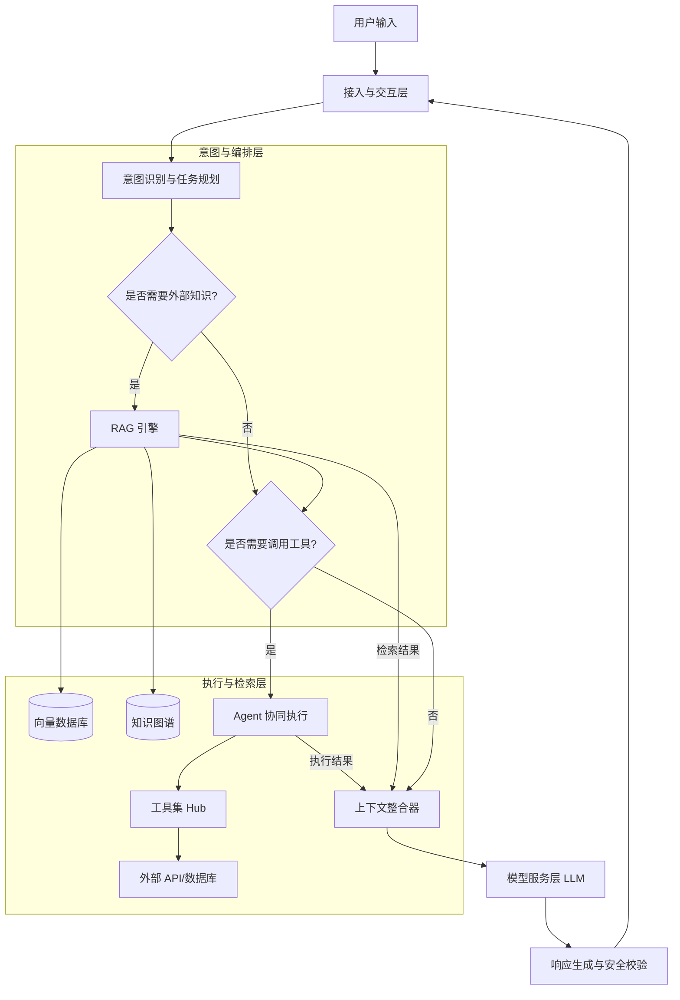

# 架构设计

在明确了四大核心概念后，我们面临的挑战是如何将这些离散的能力组装成一个健壮的、可扩展的AI原生应用。传统软件架构的“请求-响应”模型已无法适应大语言模型（LLM）带来的概率性与动态调度需求。AI原生架构的核心在于**“意图驱动的动态路由”**与**“上下文的链式编排”**。

本章将从整体架构蓝图出发，深入拆解从用户意图识别、RAG知识库检索到Agent协同执行的完整数据流转链路。

### 1. AI原生应用整体架构蓝图

一个成熟的AI原生应用架构通常分为五个逻辑层次：**接入与交互层**、**意图与编排层**、**执行与检索层**、**模型服务层**以及**基础设施层**。

下表展示了各核心层的职责与关键组件：

| 架构层次 | 核心职责 | 关键组件 |
| :--- | :--- | :--- |
| **接入与交互层** | 处理多模态输入，维护会话状态 | API Gateway, WebSocket, Session Manager |
| **意图与编排层** | 理解用户意图，规划任务，路由分发 | Intent Recognizer, Planner, LLM Router |
| **执行与检索层** | 外部知识获取，工具调用与业务执行 | RAG Engine, Vector DB, Tool Hub, Agents |
| **模型服务层** | 提供基础模型推理与词向量化能力 | LLM Cluster (GPT-4, Claude等), Embedding Model |
| **基础设施层** | 保障系统可观测性、安全与弹性扩展 | LangSmith, Prometheus, Redis, K8s |

### 2. 核心数据流转链路

当用户发起一个复杂请求时，系统内部的数据流转并非简单的线性传递，而是一个包含反馈与迭代的闭环。以下是核心链路的Mermaid流程图，展示了各组件间的协同关系：

#### 2.1 意图识别与任务规划

用户输入往往带有模糊性和上下文依赖。**意图识别**不再仅仅是匹配关键词，而是通过LLM将自然语言映射为系统可执行的内部指令。对于复杂任务，系统会引入**Planner（规划器）**，将宏大目标拆解为有向无环图（DAG）形式的子任务序列。

> **设计建议：** 在意图识别层引入“路由模型”（如轻量级微调模型或低成本LLM），专门用于判断请求的类型与复杂度，从而决定是否唤醒重量级推理模型，以此平衡响应延迟与成本。

#### 2.2 RAG 知识检索增强

在RAG阶段，系统不仅要进行向量相似度检索，还需要进行**查询重写**和**混合检索**。

1. **查询重写**：利用历史对话上下文，将用户的代词（如“它”、“那个”）补全为具体实体，生成独立的搜索查询。
2. **混合检索**：结合稠密向量检索（语义相似度）与稀疏检索（BM25关键词匹配），提升召回率。
3. **重排序**：使用交叉编码器对召回的文档块进行精排，确保喂给LLM的上下文质量最高。

#### 2.3 Agent 协同执行

当任务需要与外部世界交互（如查询实时数据库、发送邮件）时，架构进入Agent执行阶段。在多Agent场景下，我们需要定义清晰的协同模式：

*   **层级模式**：一个Orchestrator Agent负责任务分发，多个Worker Agents负责具体执行。适用于流程明确的复杂任务。
*   **顺序模式**：Agent A的输出作为Agent B的输入。适用于流水线式处理。
*   **协作辩论模式**：两个Agent针对同一问题提出方案并互相批判，最终由汇总Agent得出结论。适用于高风险决策场景。

### 3. 架构设计的关键考量

在落地上述架构时，开发者必须关注以下三个非功能性设计：

*   **状态管理与记忆机制**：LLM本身是无状态的，架构需通过外部存储（如Redis）维护短期对话历史。对于长期记忆，需将历史会话总结后向量化存入RAG系统，实现“记忆的检索增强”。
*   **安全与护栏**：在意图识别后和响应生成前，必须设置双重安全校验。输入端防范Prompt注入，输出端进行敏感信息脱敏与合规性过滤。
*   **可观测性**：AI应用的调试极具挑战性。必须在架构中埋点，记录每一步的Prompt输入、模型输出、工具调用耗时及Token消耗，构建全链路追踪体系。

通过这一套架构设计，开发者能够构建出不仅“能聊天”，更能“解决复杂业务问题”的AI原生应用。接下来的章节将进入实战环节，展示如何通过代码实现这一架构中的核心组件。
