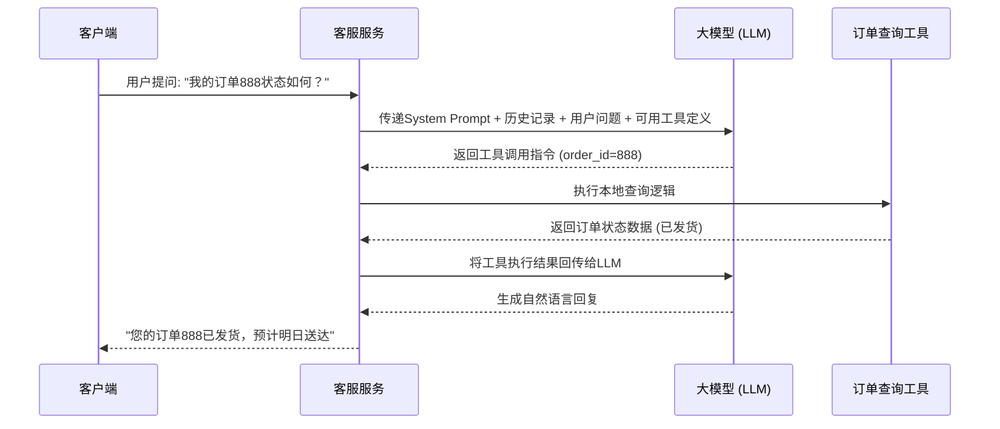

# 代码实践：构建具备工具调用能力的智能客服

前面我们探讨了上下文记忆与外部知识库集成的架构设计，现在让我们将这些概念落地为一个完整的可运行示例。本节将使用 **LangChain** 框架，演示如何构建一个具备“函数调用”能力的智能客服后端服务。

### 业务场景与架构设计

假设我们正在为一个电商平台开发后端服务。客服不仅要回答常见问题，还需要在用户询问时，动态查询真实的订单状态。为了避免大模型产生幻觉，我们将订单查询封装为一个外部工具，仅当模型判断需要时才进行调用。

> **设计理念**：LLM 在此架构中扮演“中枢大脑”的角色，负责意图识别与自然语言交互；而具体的业务操作（如查数据库）则作为确定性逻辑被解耦为独立工具。这种模式将不确定性推理与确定性执行完美分离。

整体交互时序如下：



### 代码实现

下面是完整的 Python 实现代码。该示例使用了 LangChain 的工具定义装饰器和 Agent 执行器，构建了一个带有上下文记忆与工具调用能力的智能客服后端。

```python
import os
from typing import Optional
from langchain_core.tools import tool
from langchain_openai import ChatOpenAI
from langchain.agents import create_tool_calling_agent, AgentExecutor
from langchain_core.prompts import ChatPromptTemplate, MessagesPlaceholder
from langchain_core.messages import AIMessage, HumanMessage
from langchain_community.chat_message_histories import ChatMessageHistory
from langchain_core.runnables.history import RunnableWithMessageHistory

# 1. 定义外部工具
# 使用 @tool 装饰器将普通函数转化为 LLM 可识别的工具
@tool
def query_order_status(order_id: str) -> str:
    """根据订单ID查询订单的物流状态。
    
    Args:
        order_id: 用户的订单编号，通常为纯数字。
        
    Returns:
        订单的当前状态描述字符串。
    """
    # 此处模拟数据库查询逻辑
    mock_database = {
        "888": "已发货，预计明日送达",
        "999": "正在打包中，预计今日下午发出",
        "101": "已完成"
    }
    status = mock_database.get(order_id)
    if status:
        return f"订单 {order_id} 的状态为：{status}"
    return f"未找到订单号为 {order_id} 的记录，请确认订单号是否正确。"

# 2. 初始化大模型与 Prompt
# 确保环境变量中已配置 OPENAI_API_KEY
os.environ["OPENAI_API_KEY"] = "your-api-key-here"

# 使用支持函数调用的模型
llm = ChatOpenAI(model="gpt-4o-mini", temperature=0.3)

# 构建 Prompt 模板，必须包含 agent_scratchpad 以供模型记录思考过程
prompt = ChatPromptTemplate.from_messages([
    ("system", "你是一个专业的电商客服助手。请礼貌地回答用户问题。"
               "如果用户询问订单状态，请务必使用提供的工具查询，不要凭空捏造。"),
    MessagesPlaceholder(variable_name="chat_history", optional=True),
    ("human", "{input}"),
    MessagesPlaceholder(variable_name="agent_scratchpad"),
])

# 3. 组装 Agent 与执行器
# create_tool_calling_agent 会自动处理模型与工具的绑定
tools = [query_order_status]
agent = create_tool_calling_agent(llm, tools, prompt)

# AgentExecutor 负责管理 LLM 与工具之间的循环交互
agent_executor = AgentExecutor(agent=agent, tools=tools, verbose=True)

# 4. 接入上下文记忆管理
# 使用 RunnableWithMessageHistory 包装 Agent，实现多轮对话记忆
# 这里使用内存存储，生产环境可替换为 Redis 或数据库存储
message_history = ChatMessageHistory()

conversational_agent = RunnableWithMessageHistory(
    agent_executor,
    lambda session_id: message_history,
    input_messages_key="input",
    history_messages_key="chat_history",
)

# 5. 模拟客户端调用
if __name__ == "__main__":
    session_id = "user_session_001"
    
    print("--- 第一轮对话 ---")
    response1 = conversational_agent.invoke(
        {"input": "你好，我想查一下我的订单状态。"},
        config={"configurable": {"session_id": session_id}},
    )
    print(f"客服回复: {response1['output']}\n")
    
    print("--- 第二轮对话 (测试记忆与工具调用) ---")
    response2 = conversational_agent.invoke(
        {"input": "我的订单号是888，帮我看看发没发货。"},
        config={"configurable": {"session_id": session_id}},
    )
    print(f"客服回复: {response2['output']}\n")
    
    print("--- 第三轮对话 (测试上下文记忆) ---")
    response3 = conversational_agent.invoke(
        {"input": "我刚才查的那个订单大概几天能到？"},
        config={"configurable": {"session_id": session_id}},
    )
    print(f"客服回复: {response3['output']}\n")
```

### 关键实现解析

在这个代码实践中，有几个工程细节值得开发者特别关注：

1. **工具定义规范**：`@tool` 装饰器会自动提取函数的文档字符串作为 LLM 的工具描述。大模型正是依赖这段描述来判断何时调用该工具。因此，**函数的 docstring 必须清晰、准确地说明工具的功能及参数含义**。
2. **Agent 执行器**：`AgentExecutor` 是一个控制循环。当模型返回工具调用指令时，执行器会挂起模型的响应，转而执行本地工具，然后将工具的返回结果再次喂给模型，直到模型认为可以输出最终的自然语言回复。
3. **记忆组件集成**：通过 `RunnableWithMessageHistory`，我们将上一章提到的“上下文记忆管理”无缝接入。在第三轮对话中，用户没有提供订单号，但模型能够通过 `chat_history` 知道用户指的是“订单888”，这就是上下文记忆在发挥作用。

### 生产环境演进建议

上述示例虽然可运行，但在走向生产环境时，还需进行以下工程化加固：

* **异步处理**：将 `AgentExecutor` 替换为异步版本，以提升后端服务的并发处理能力。
* **工具权限控制**：在执行查询类工具前，增加鉴权拦截器，确保当前用户有权查询目标订单。
* **异常降级**：当 LLM 服务超时或工具调用失败时，设计合理的降级策略，如返回静态缓存的常见问题解答，保障服务可用性。
* **可观测性**：接入 LangSmith 等工具，对 Prompt 的组装过程、Token 消耗、工具调用链路进行全链路追踪，这对于调试 AI 应用至关重要。
