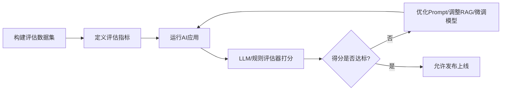

# 最佳实践与经验总结

在前面的章节中，我们从提示词工程、RAG架构设计一路探讨到了具备工具调用能力的智能客服代码实践。当应用从“原型演示”走向“生产环境”时，决定成败的往往不再是模型本身的能力，而是工程化规范与架构设计。本章将总结AI驱动应用开发中的核心最佳实践，帮助开发者规避“AI原生”特有的工程陷阱。

### Prompt版本管理：将提示词视为一等公民

在传统软件开发中，我们绝不会将核心业务逻辑硬编码且不加版本控制。然而在AI应用中，**Prompt就是业务逻辑**。模型API的升级、底层模型的替换，都可能导致原本运行良好的Prompt失效。因此，必须将Prompt从代码中抽离，进行独立版本管理。

实践建议：
1. **外置化管理**：使用数据库或文件系统（如YAML/JSON）存储Prompt模板，避免将其写死在Java或Python代码中。
2. **绑定模型版本**：记录当前Prompt验证通过的模型版本（如`gpt-4-0613`或`qwen-max-2024-04-15`），因为同一Prompt在不同版本模型上的表现可能大相径庭。
3. **A/B测试与回滚机制**：支持线上动态切换Prompt版本，当新版本Prompt导致输出质量下降时，能秒级回滚。

### AI生成代码的强制审查机制

随着GitHub Copilot、Cursor等工具的普及，AI辅助编码极大提升了开发效率。但大模型存在“幻觉”，可能生成看似正确实则存在隐蔽漏洞的代码（如不安全的反序列化、资源泄漏或逻辑死循环）。**无论AI生成的代码看起来多么完美，强制人工审查都是不可逾越的红线。**

在CI/CD流程中，应引入静态代码分析工具（如SonarQube）拦截AI生成的低质量代码。同时，开发者需转变心态：你不再是代码的“编写者”，而是代码的“架构师与审查者”。必须对每一行合入主干的AI生成代码负最终责任。

### 评估驱动开发(EDD)

测试驱动开发（TDD）要求先写测试再写代码，而在AI应用中，这一范式演变为**评估驱动开发**。由于大模型输出具有非确定性，传统的单元测试（断言相等）往往失效，我们需要建立一套针对AI输出的自动化评估体系。



EDD的核心在于构建“黄金数据集”——包含典型业务场景的输入与期望输出。每次迭代Prompt或更换模型时，自动运行评估集，通过量化指标（如准确率、相关性、无害性）来判断应用是否发生退化。

### 人在回路的系统设计

在涉及资金交易、用户隐私或高风险决策的场景中，完全信任AI的自主决策是极其危险的。**HITL设计要求在关键工作流中插入人工审批节点**。

以下是一个典型的“高意图-低风险”自动化与“高意图-高风险”人工干预相结合的架构设计：

```java
/**
 * 订单退款处理服务 - 演示 HITL 设计模式
 */
public class RefundService {

    private final LLMClient llmClient;
    private final HumanReviewQueue reviewQueue;

    public RefundService(LLMClient llmClient, HumanReviewQueue reviewQueue) {
        this.llmClient = llmClient;
        this.reviewQueue = reviewQueue;
    }

    public void processRefundRequest(String userId, String orderId, String reason) {
        // 1. 调用大模型分析退款意图与合理性，并提取金额
        RefundAnalysis analysis = llmClient.analyzeRefundIntent(userId, orderId, reason);
        
        // 2. 核心策略：基于风险评估的分支路由
        if (analysis.getRefundAmount().compareTo(new BigDecimal("100.00")) <= 0 
                && analysis.getRiskScore() < 0.2) {
            // 低风险且小额：自动执行退款
            executeRefund(orderId, analysis.getRefundAmount());
        } else {
            // 高风险或大额：挂起任务，进入人工审核队列
            PendingTask task = new PendingTask(
                UUID.randomUUID().toString(), 
                userId, 
                orderId, 
                analysis, // 包含AI的分析结果供人工参考
                TaskType.REFUND_REVIEW
            );
            reviewQueue.enqueue(task);
            sendUserNotification(userId, "您的退款请求正在人工审核中，请耐心等待。");
        }
    }

    private void executeRefund(String orderId, BigDecimal amount) {
        // 调用支付网关执行退款逻辑
        // ...
    }
    
    // 其他辅助方法...
}
```

在上述代码中，AI承担了繁重的“意图理解与信息提取”工作，但最终的“执行”动作被网关拦截。当金额超过阈值或风险评分较高时，系统将AI的分析结果作为辅助决策材料，推送到人工审核队列。这种设计既利用了AI的效率，又守住了业务安全的底线。

### 总结

构建AI驱动的下一代智能应用，不仅需要掌握提示词工程与模型调用，更要求开发者将传统软件工程的严谨性引入非确定性的AI系统中。通过实施Prompt版本管理、坚守AI代码审查红线、落地评估驱动开发(EDDD)以及设计稳健的人回路(HITL)架构，我们才能将大模型的潜力转化为真正可靠的生产力。
