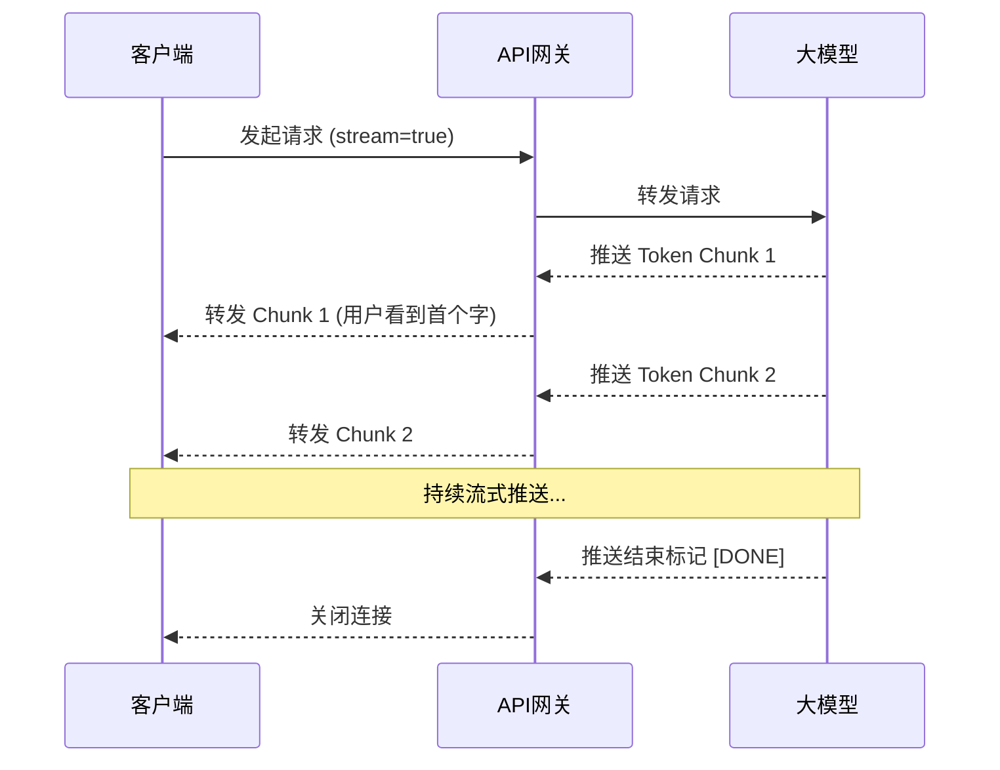

# 性能优化

在解决了稳定性与容错问题后，LLM应用走向生产环境的下一道关卡便是“性能”。与传统I/O密集型应用不同，LLM应用的性能瓶颈不仅体现在网络请求上，更核心的是**大模型推理计算带来的高昂时间成本与吞吐量限制**。如果每次用户交互都需要等待几秒甚至十几秒才能看到完整响应，应用的留存率将遭受毁灭性打击。

本节将从首字延迟、重复调用、模型选型与任务编排四个维度，深入探讨LLM应用的性能调优方案。

### 1. 流式输出：降低首字延迟（TTFB）

在传统API设计中，客户端通常等待服务端完成全部计算后一次性接收响应。但在LLM场景下，如果让用户盯着Loading图标等待模型生成完几百上千个Token，体验是极其糟糕的。

**核心解法是采用流式输出（Server-Sent Events, SSE）**。流式输出将模型的生成过程拆解为多个Token块，服务端每生成一个Token就立即推送到客户端。虽然模型生成完整回答的总时间并未缩短，但**首字延迟**被大幅降低至几百毫秒级别。



**工程实践建议**：在实现流式输出时，网关层需注意关闭Nginx的`proxy_buffering`指令（设为`off`），否则SSE数据会被Nginx缓冲，导致流式效果失效。同时，客户端在接收到流数据时，应采用增量渲染策略，避免频繁引发DOM重绘。

### 2. 语义缓存：精准拦截重复调用

在RAG或客服问答场景中，往往存在大量高度相似的提问（例如“怎么重置密码”、“忘记密码怎么办”）。传统Web开发中基于URL或参数哈希的缓存机制在此刻失效，因为字面量不同但语义相同的请求无法命中缓存。

**语义缓存**通过Embedding模型将用户Query转化为向量，并在向量数据库中进行相似度检索。当相似度超过设定阈值时，直接返回历史结果，从而绕过大模型调用。

| 缓存类型 | 命中条件 | 优势 | 劣势 |
| :--- | :--- | :--- | :--- |
| 传统缓存 | Key完全匹配 (哈希一致) | 速度极快，无精度损耗 | 命中率极低，无法处理变体表达 |
| 语义缓存 | 向量相似度 > 阈值 (如0.95) | 大幅减少Token消耗与延迟 | 存在“假阳性”风险（语义偏移） |

**防穿透策略**：语义缓存最大的风险在于“答非所问”。例如“苹果公司市值”和“苹果怎么吃”在字面上相似度不低，但语义南辕北辙。因此，在检索到相似历史Query后，可引入一个轻量级的规则校验或小模型校验，确认两者确实属于同一意图后再返回缓存结果。

### 3. 模型路由策略：成本与质量的动态平衡

随着开源生态繁荣，开发者手中往往拥有多种模型（如GPT-4、Claude-3、Llama-3等）。不同模型在推理速度、上下文长度、逻辑推理能力和价格上差异巨大。将所有请求都发往最强模型不仅造成资源浪费，还会导致响应缓慢。

**模型路由机制**根据请求的复杂度、上下文长度和业务重要性，动态选择最合适的模型：

*   **意图分类路由**：前置一个极速小模型（如Llama-3-8B或专门训练的分类器）对用户意图进行判定。闲聊或简单百科问题路由给本地小模型；复杂代码生成或多步逻辑推理路由给GPT-4级别模型。
*   **降级路由**：当高阶模型API超时或限流时，自动降级到备用模型，保证系统可用性。
*   **特征路由**：根据Token长度路由。短文本走响应更快的模型，长文本走支持大Context的模型。

### 4. 异步并发任务编排

当应用需要处理复杂任务（如长文档总结、多源数据聚合分析）时，串行调用大模型会导致延迟呈线性增长。开发者应充分利用异步并发机制重塑任务流。

**场景案例**：用户上传一份100页的财报，要求生成摘要并提取关键财务指标。

*   **低效方案（串行）**：分块 -> 请求LLM总结块1 -> 请求LLM总结块2 -> ... -> 合并结果 -> 请求LLM生成最终摘要。耗时极长。
*   **高效方案（并发+Map-Reduce）**：利用异步并发框架（如Python的`asyncio`或Java的`CompletableFuture`）同时发起多个分块总结请求，待全部完成后，再发起最终的Reduce请求。

以下是一个基于Java `CompletableFuture` 实现并发调用LLM的简化示例：

```java
import java.util.List;
import java.util.concurrent.CompletableFuture;
import java.util.concurrent.ExecutorService;
import java.util.concurrent.Executors;
import java.util.stream.Collectors;

public class LLMConcurrentOrchestrator {

    // 模拟大模型调用客户端
    private LLMClient llmClient = new LLMClient();
    // 自定义线程池，避免阻塞主线程并控制并发度
    private ExecutorService executor = Executors.newFixedThreadPool(10);

    public String processLongDocumentConcurrently(List<String> documentChunks) {
        // 1. Map阶段：并发处理各个文档分块
        List<CompletableFuture<String>> chunkFutures = documentChunks.stream()
                .map(chunk -> CompletableFuture.supplyAsync(() -> {
                    // 每个分块异步调用LLM进行总结
                    return llmClient.summarize(chunk);
                }, executor))
                .collect(Collectors.toList());

        // 等待所有分块任务完成
        CompletableFuture<Void> allFutures = CompletableFuture.allOf(
                chunkFutures.toArray(new CompletableFuture[0])
        );

        // 2. Reduce阶段：合并所有分块结果
        CompletableFuture<String> reducedFuture = allFutures.thenApply(v -> {
            String combinedSummary = chunkFutures.stream()
                    .map(CompletableFuture::join)
                    .collect(Collectors.joining("\n\n"));
            
            // 将合并后的结果再次发送给LLM进行最终提炼
            return llmClient.refine(combinedSummary);
        });

        // 设置超时时间，防止某个模型请求挂起拖垮全局
        try {
            return reducedFuture.get(60, java.util.concurrent.TimeUnit.SECONDS);
        } catch (Exception e) {
            throw new RuntimeException("LLM并发编排超时或失败", e);
        }
    }
}

// 模拟客户端
class LLMClient {
    public String summarize(String text) { /* 调用大模型API */ return "summary of " + text; }
    public String refine(String text) { /* 调用大模型API */ return "refined result"; }
}
```

**并发编排注意事项**：在引入并发机制时，必须对底层大模型API的**速率限制**有清晰认知。如果并发量超过限制，会触发429错误。因此，在工程实现上，通常需要配合令牌桶算法或请求队列，对并发任务进行节流控制。

性能优化并非一蹴而就，它是架构设计、模型能力与工程技巧的综合博弈。通过流式输出安抚用户情绪，语义缓存拦截无效计算，模型路由优化资源分配，并发编排榨干硬件吞吐，开发者才能打造出既聪明又敏捷的AI原生应用。
