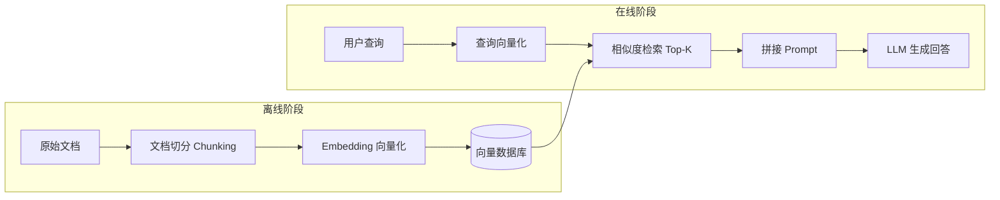

# RAG 原理与整体链路

RAG（Retrieval-Augmented Generation，检索增强生成）是解决大模型"幻觉"与知识滞后性的核心架构。其本质是为模型外挂一个动态知识库，把"闭卷考试"变成"开卷考试"。

## 为什么需要 RAG

大语言模型存在两个先天缺陷：

1. **知识截止**：模型只知道训练数据截止日期之前的信息，无法回答最新问题
2. **私有知识缺失**：模型不了解你公司的内部文档、产品手册、代码库

微调（Fine-tuning）可以注入知识，但成本高、更新慢。RAG 则在**推理时动态检索**相关知识拼入上下文，成本低且知识可实时更新。

## RAG 三阶段链路

### 1. 数据离线处理

将私有文档切分为语义连贯的文本块（Chunk），通过 Embedding 模型转化为高维向量，存入向量数据库（如 Milvus、Qdrant）。

### 2. 在线检索

将用户的实时查询同样向量化，在向量数据库中计算余弦相似度，召回 Top-K 最相关的文本块。

### 3. 增强生成

将召回的文本块作为上下文拼接到提示词中，交由 LLM 归纳与回答，并要求模型"仅基于给定上下文回答"。

## 核心组件选型

| 组件 | 主流选择 | 选型要点 |
| :--- | :--- | :--- |
| **Embedding 模型** | OpenAI text-embedding-3、BGE、M3E | 中文场景优先选中文优化模型 |
| **向量数据库** | Milvus、Qdrant、pgvector | 数据量、元数据过滤能力、运维成本 |
| **重排序模型** | bge-reranker、Cohere Rerank | 精排提升召回质量 |
| **编排框架** | LangChain、LlamaIndex | LlamaIndex 在 RAG 场景更深入 |

> **工程要点**：RAG 的难点不在链路搭建，而在**召回质量**。后续章节将深入切分策略与检索优化。
