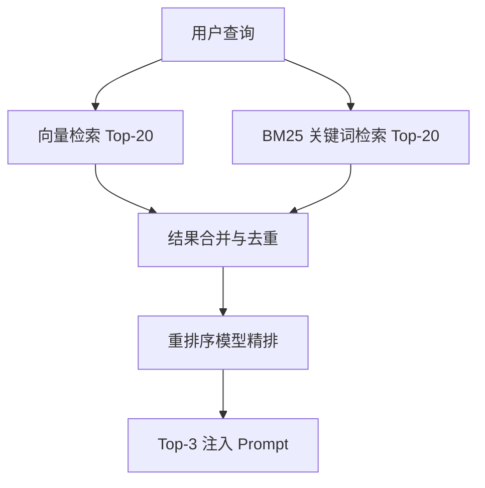

# 检索优化：混合检索与重排序

基线 RAG 系统最常见的问题是"检索不准"：明明知识库里有答案，却召回了不相关的内容。本章介绍生产级检索优化的三板斧。

## 1. 查询重写

用户的原始查询往往不适合直接检索：

- **代词依赖**：多轮对话中的"它怎么配置？"缺少主语
- **口语化**：与文档的书面表达存在词汇鸿沟
- **多意图**：一个问题包含多个子问题

解决方案是在检索前用 LLM 重写查询：

```text
根据对话历史，将用户的最新问题改写为一个独立、完整的搜索查询。

对话历史：
用户：Milvus 支持元数据过滤吗？
助手：支持，可以通过 expr 表达式实现。
用户：那性能怎么样？

改写结果：Milvus 元数据过滤（expr 表达式）的性能表现如何？
```

## 2. 混合检索

单一的向量检索存在语义漂移问题，专有名词、编号、代码符号等精确匹配场景反而是传统关键词检索（BM25）的强项。

**混合检索 = 稠密向量检索（语义） + 稀疏检索（关键词）**，两路召回后合并去重：



## 3. 重排序

召回阶段（向量检索）使用双编码器，速度快但精度有限。重排序（Rerank）阶段使用**交叉编码器**，将查询与每个候选文档拼接后逐一打分，精度显著更高。

典型配置：召回 Top-20 → 重排取 Top-3 注入提示词。这样既保证了召回率，又严格控制了注入上下文的体积，避免"中间迷失"。

## 效果评估指标

优化必须建立在度量之上。RAG 检索常用指标：

| 指标 | 含义 | 目标 |
| :--- | :--- | :--- |
| **Hit Rate** | Top-K 结果中包含正确答案的比例 | 越高越好 |
| **MRR** | 正确答案排名的倒数均值 | 越高越好 |
| **忠实度** | 回答内容是否忠实于检索到的上下文 | 检测幻觉 |
| **答案相关性** | 回答与问题的相关程度 | 端到端质量 |

## 常见排错清单

1. **召回内容不相关** → 检查切分质量、尝试混合检索、检查 Embedding 模型是否匹配语言
2. **有召回但回答错误** → 检查提示词是否明确要求"仅基于上下文回答"、召回块是否太多导致中间迷失
3. **专有名词查不到** → 引入 BM25 混合检索
4. **多轮对话失效** → 引入查询重写

> **总结**：查询重写解决"问得不好"，混合检索解决"找得不全"，重排序解决"排得不准"。三者组合是生产级 RAG 的标配。
